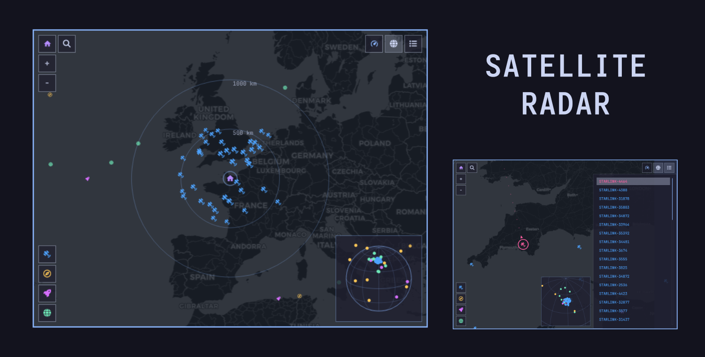

# Satellite Radar for Omarchy

Track satellites from the Omarchy bar on a live OpenStreetMap view and mini
globe.



## Features

- Starlink, navigation satellites, space stations, and visual satellites
- Live ground tracks, trajectories, filters, search, and satellite tracking
- Shared location with Omarchy Weather
- Draggable and zoomable map and mini globe
- Balanced (60), High (150), Maximum (300), and Global modes
- Mouse and keyboard controls

## Install

```sh
omarchy plugin add https://github.com/SeanGSR/omarchy-satellite-radar.git --enable
```

Requires `node`, `curl`, and `jq`. `satellite.js` is included.

## Controls

- Drag to pan; scroll or use `+` / `−` to zoom
- Click a satellite to track it
- Use the toolbar for search, performance mode, globe, list, and keyboard help
- Global mode shows the full supported catalog with Starlink hidden by default

Keyboard shortcuts:

- `↑` / `↓` or `J` / `K`: select satellite
- `Enter` / `Space`: track selection
- `←` / `→`: pan map
- `+` / `−`: zoom
- `S` or `/`: search
- `I`: satellite list
- `G`: mini globe
- `P`: performance menu
- `R`: refresh now
- `C` or `0`: recenter
- `1`–`4`: toggle satellite categories
- `?`: keyboard help
- `Escape`: close the active layer or panel

## Configure

```sh
omarchy bar set ldng.satellite-radar minimumElevation 10
omarchy bar set ldng.satellite-radar performanceMode High
```

## Network and privacy

- CelesTrak: orbital elements
- CARTO/OpenStreetMap: map tiles
- Open-Meteo: city search
- GeoJS: fallback IP-based location

TLE data is cached in `~/.cache/omarchy-satellite-radar` for two hours. Failed
requests back off for 15 minutes. Set a location manually to avoid the GeoJS
fallback.

Positions are predictions from TLE data, not live GPS telemetry. Do not use
this plugin for navigation or collision avoidance.

## Remove

```sh
omarchy plugin remove ldng.satellite-radar
```

## License

[MIT](LICENSE). The included `satellite.js` license is in
[`vendor/SATELLITE_JS_LICENSE.md`](vendor/SATELLITE_JS_LICENSE.md).

Map data © OpenStreetMap contributors. Map tiles © CARTO.
